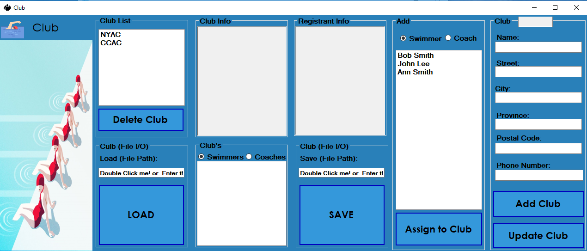

# Swimming-Manager-Application 
## programming02 project 
> Following are some screenshots for Swimming-manager-application 

Swim Meet application is a very complex application that can keep track of Club, Swimmer, Coach, Registrant, Event and Swim meet. Swim meet had additional feature to assign each registrant to specific club and to related coach. Assigned Swimmers can then be entered in many events and seed method can then be performed on swimmers to assign them proper swimming lane and Heat.

Application used txt file as primary source of database. Moreover user can perform CRUD operation on each section. special sounds were added to application in order to make it easy for the user's navigation.

## Menu
 

## Event
 

## Swimmer Registration
 

## Club
 

## Coach
  

## Swim Meet
  
